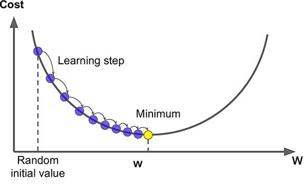
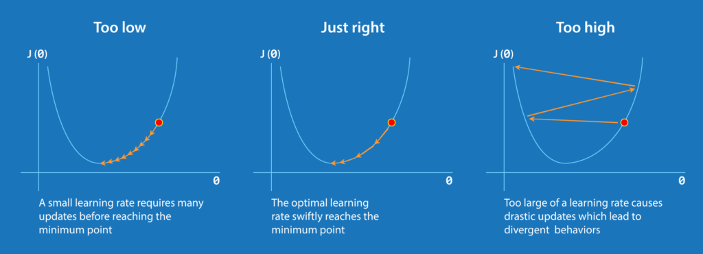
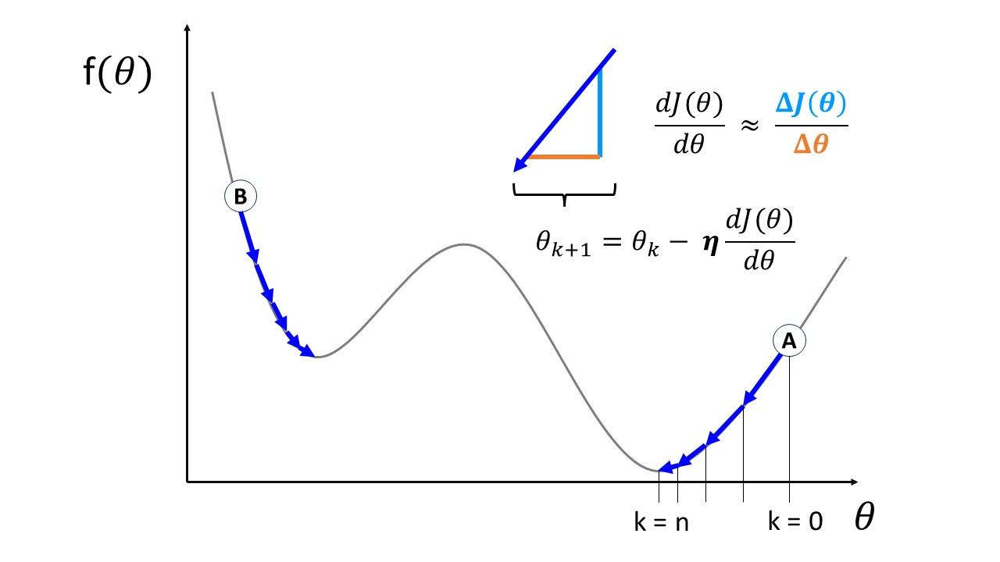

# Training Models

## Linear Regression

A linear model makes a prediction by simply computing a wighted sum of the input features, plus a constant called the *bias term* (also called the *intercept term*).

$$
\hat{y} = \theta_0 + \theta_1x_1 + \theta_2x_2+...+\theta_nx_n
$$

- $\hat{y}$ is the predicted value
- n is the number of features
- $x_i$ is the ith feature value
- $\theta_j$ is the jth model parameter (including the bias term $\theta_0$ and the feature weights  $\theta_1,\theta_2,...\theta_n$)

This can be written much more concisely using a vectorized form:

$$
\hat{y} = h_{\theta}(x) = \theta \cdot x
$$

- $\theta$ is the model's *parameter vector*, containing the bias term $\theta_0$ and the feature wights $\theta_1$ to $\theta_n$
- **x** is the instance's *feature vector*, containing $x_0$ to $x_n$ with $x_0$ always equal to 1.
- $\theta \cdot x$ is the dot product of the vectors $\theta$ and **x**, which is of course equal to $\theta_0x_0 + \theta_1x_1 + \theta_2x_2+...+\theta_nx_n$
- $h_\theta$ is the hypothesis function, using the model parameters $\theta$

Normally, is better to code a 2D array with a single row. However, a vector is actually a 2D array with a single *column*. The way to fix it is to rewrite the equation with the transpose of the parameters matrix:
$$
\hat{y}=\theta^Tx
$$

## Evaluating the Linear Regression

The Root Mean Square Error (RMSE) is the most common way to measure the performance of a regression model. We need to find the value of $\theta$ that minimizes the RMSE. In practise, it's easier to minimize the Mean Squared Error (MSE) and it leads to the same result.
$$
MSE(X,h_\theta) = \frac{1}{m}\sum_{i=1}^{m}(\theta^Tx^{(i)}-y^{(i)})^2
$$

### The Normal Equation

To find the value of $\theta$ that minimizes the cost function, there is a *closed-form* solution.
$$
\hat{\theta} = (X^TX)^{-1}X^Ty
$$

- $\hat{\theta}$ is the value that minimizes the function
- y is the vector of target values containig $y^(i)$

To know more about this equation: https://www.geeksforgeeks.org/ml-normal-equation-in-linear-regression/

## Gradient Descent

Gradient Descent is a generic optimization algorithm capable of finding optimal solutions to a wide range of problems.

You start by filling $\theta$ with random values (this is called *random initialization*). Then you improve it gradually, taking one baby step at a time, each step attempting to decrease the cost function, until the algorithm *converges* to a minimum.

An important parameter in Gradient Descent is the size of the steps, determined by the *learning rate* hyperparameter. If the learning rate is too small, then the algorithm will have to go through many iterations to converge, which will take a long time.

An important parameter is the size of the steps, determined by the *learning rate* hyperparameter. If the learning rate is too small, then the algorithm will have to go through many iterations to converge which takes long time.

If the learning rate is too high, you might jump across the valley and end up on the other side. This makes the algorithm diverge with larger and larger values, failing to find a good solution.

If the random initialization starts the algorithm on the left, it will converge to a *local minimum*, which is not as good as the *global minimum*.

If it starts on the right, then it will take a very long time to cross the plateau. And if you stop too early, you will never reach the global minimum.

However, the Gradient Descent is guaranteed to approach arbitrarily close the global minimum.

### Batch Gradient Descent

In other words, you need to calculate how much the cost function will change if you change the parameter just a little bit. This is called a *partial derivative*.

$$
\frac{\partial}{\partial\theta_j}\text{MSE($\theta)$}=\frac{2}{m}\sum_{i=1}^{m}(\theta^Tx^{(i)-y^{(i)}}x_j^{(i)}
$$

However, this should take some time. Instead, you can use the gradient vector:
$$
\nabla_\theta\text{MSE($\theta)$}=\begin{bmatrix}
    \frac{\partial}{\partial\theta_0}\text{MSE($\theta)$} \\
    \frac{\partial}{\partial\theta_1}\text{MSE($\theta)$} \\
		\vdots \\
		\frac{\partial}{\partial\theta_n}\text{MSE($\theta)$}
    \end{bmatrix}=\frac{2}{m}X^T(X\theta - y)
\\
$$

One you have the gradient vector, you need to subtract $\nabla_\theta\text{MSE($\theta)$} $ from $\theta$ with the learning rate multiplying it ($\eta$)

$$
\theta^{(\textbf{next step})} = \theta - \eta\nabla_\theta\text{MSE($\theta)$}
$$
