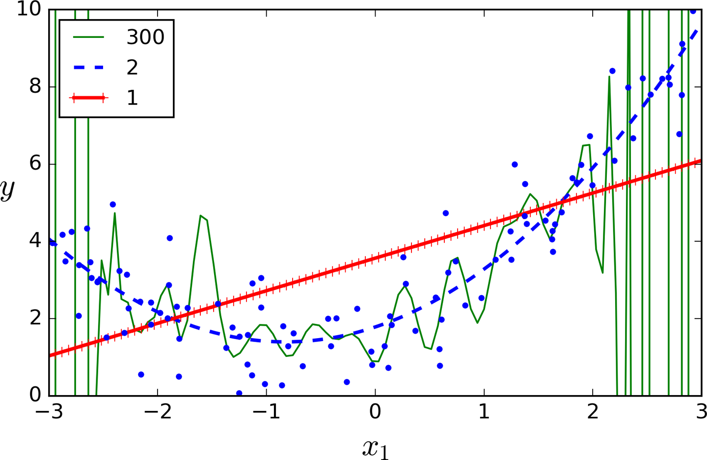
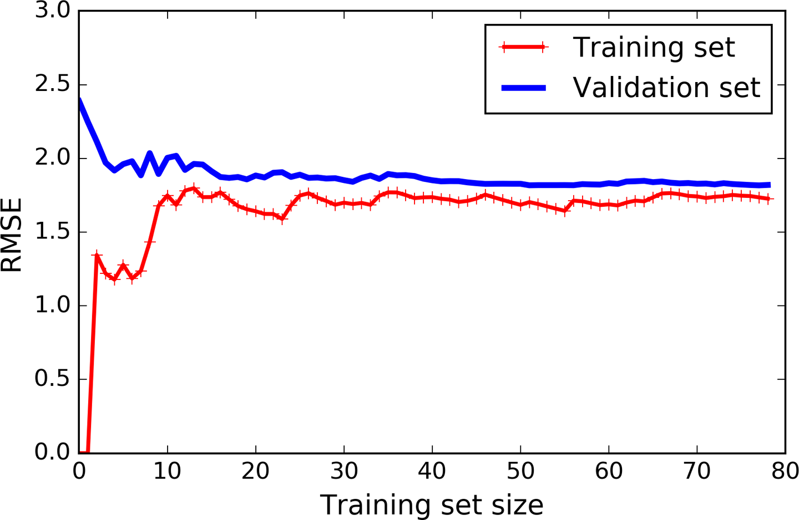
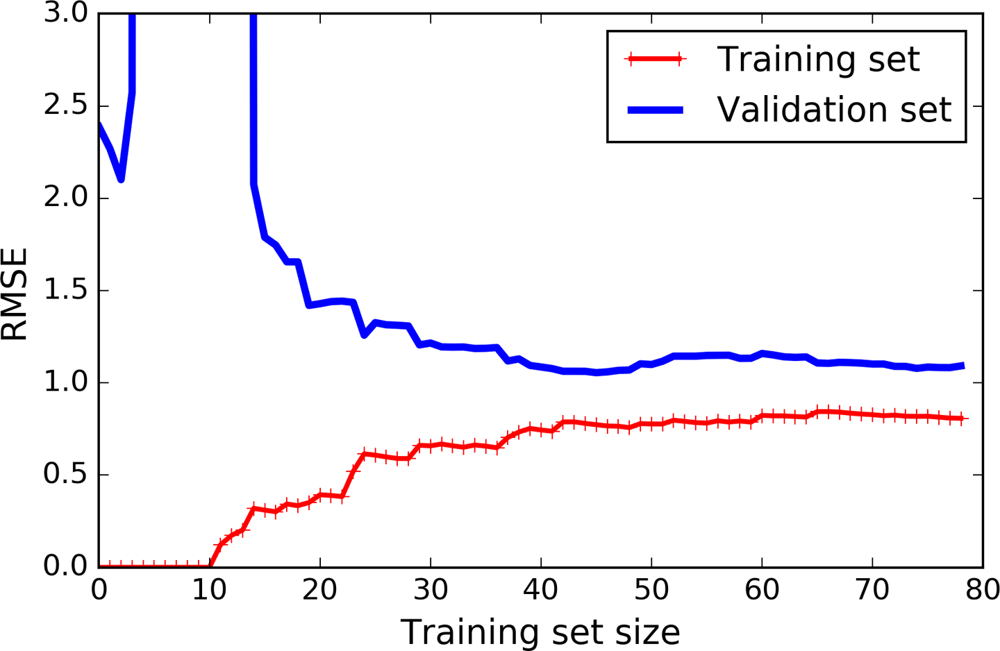

# Training Models

## Linear Regression

A linear model makes a prediction by simply computing a wighted sum of the input features, plus a constant called the *bias term* (also called the *intercept term*).

$$
\hat{y} = \theta_0 + \theta_1x_1 + \theta_2x_2+...+\theta_nx_n
$$

- $\hat{y}$ is the predicted value
- n is the number of features
- $x_i$ is the ith feature value
- $\theta_j$ is the jth model parameter (including the bias term $\theta_0$ and the feature weights  $\theta_1,\theta_2,...\theta_n$)

This can be written much more concisely using a vectorized form:

$$
\hat{y} = h_{\theta}(x) = \theta \cdot x
$$

- $\theta$ is the model's *parameter vector*, containing the bias term $\theta_0$ and the feature wights $\theta_1$ to $\theta_n$
- **x** is the instance's *feature vector*, containing $x_0$ to $x_n$ with $x_0$ always equal to 1.
- $\theta \cdot x$ is the dot product of the vectors $\theta$ and **x**, which is of course equal to $\theta_0x_0 + \theta_1x_1 + \theta_2x_2+...+\theta_nx_n$
- $h_\theta$ is the hypothesis function, using the model parameters $\theta$

Normally, is better to code a 2D array with a single row. However, a vector is actually a 2D array with a single *column*. The way to fix it is to rewrite the equation with the transpose of the parameters matrix:

$$
\hat{y}=\theta^Tx
$$

## Evaluating the Linear Regression

The Root Mean Square Error (RMSE) is the most common way to measure the performance of a regression model. We need to find the value of $\theta$ that minimizes the RMSE. In practise, it's easier to minimize the Mean Squared Error (MSE) and it leads to the same result.

$$
MSE(X,h_\theta) = \frac{1}{m}\sum_{i=1}^{m}(\theta^Tx^{(i)}-y^{(i)})^2
$$

### The Normal Equation

To find the value of $\theta$ that minimizes the cost function, there is a *closed-form* solution.

$$
\hat{\theta} = (X^TX)^{-1}X^Ty
$$

- $\hat{\theta}$ is the value that minimizes the function
- y is the vector of target values containig $y^(i)$

To know more about this equation: https://www.geeksforgeeks.org/ml-normal-equation-in-linear-regression/

## Gradient Descent

Gradient Descent is a generic optimization algorithm capable of finding optimal solutions to a wide range of problems.

You start by filling $\theta$ with random values (this is called *random initialization*). Then you improve it gradually, taking one baby step at a time, each step attempting to decrease the cost function, until the algorithm *converges* to a minimum.

An important parameter in Gradient Descent is the size of the steps, determined by the *learning rate* hyperparameter. If the learning rate is too small, then the algorithm will have to go through many iterations to converge, which will take a long time.

An important parameter is the size of the steps, determined by the *learning rate* hyperparameter. If the learning rate is too small, then the algorithm will have to go through many iterations to converge which takes long time.

If the learning rate is too high, you might jump across the valley and end up on the other side. This makes the algorithm diverge with larger and larger values, failing to find a good solution.

If the random initialization starts the algorithm on the left, it will converge to a *local minimum*, which is not as good as the *global minimum*.

If it starts on the right, then it will take a very long time to cross the plateau. And if you stop too early, you will never reach the global minimum.

However, the Gradient Descent is guaranteed to approach arbitrarily close the global minimum.

> When using Gradient Descent, you should ensure that all features have a smiliar scale or else it will take much longer to converge

### Batch Gradient Descent

In order to implement the Gradient Descent, you need to calculate how much the cost function will change if you change the parameter just a little bit. This is called a *partial derivative*.

$$
\frac{\partial}{\partial\theta_j}\text{MSE($\theta)$}=\frac{2}{m}\sum_{i=1}^{m}(\theta^Tx^{(i)-y^{(i)}}x_j^{(i)}
$$

However, this should take some time. Instead, you can use the gradient vector:

$$
\nabla_\theta\text{MSE($\theta)$}=\begin{bmatrix}
    \frac{\partial}{\partial\theta_0}\text{MSE($\theta)$} \\
    \frac{\partial}{\partial\theta_1}\text{MSE($\theta)$} \\
		\vdots \\
		\frac{\partial}{\partial\theta_n}\text{MSE($\theta)$}
    \end{bmatrix}=\frac{2}{m}X^T(X\theta - y)
\\
$$

One you have the gradient vector, you need to subtract

$$ 
\nabla_\theta\text{MSE($\theta)$}
$$

from $\theta$ with the learning rate multiplying it ($\eta$)

$$
\theta^{(\textbf{next step})} = \theta - \eta\nabla_\theta\text{MSE($\theta)$}
$$

To find a good learning rate you can use grid search. However, you may want to limit the number of iterations so that the grid search can eliminate models that take too long to converge.

A simple solution is to set a very large number of iterations but to interrupt the algorithm when the gradient vector becones tiny - when its norm becomes smaller than a tiny number $\epsilon$ (called _tolerance_) - because this happens when the Gradient has reached almost its minimum.

## Stochastic Gradient Descent

The main problem with the Batch Gradient Descent is that it uses the whole training set to compute the gradients at every step, which make it very slow when the training set is large.

The Stochastic Gradient Descent picks a random instance in the training set at every step and computes the radients based only on that single instance. Working on a single instance at a time makes the algorithm much faster because it has very little data to manipulate at every iteration, making it possible to train huge data training sets.

When the cost function is very irregular, this can actually help the algorithm jump out of local minima and finding the global minimum - better than the Batch Gradient Descent does.

On the other hand, due to its stochastic nature, this algorithm is much less regular than the other one. Over time it will end up very close to the minimum, but once it gets there it will continue to bounce around, never settling down. **So once the algorithm stops, the final parameter values are good but not optimal**.

One solution is to gradually reduce the learning rate. The steps start out large, then get smaller and smaller allowing the algorithm to settle at the global minimum. The function that determines the learning rate at each iteration is called the *learning schedule*.

## Mini-batch Gradient Descent

Instead of computing the gradients based on the full training set or based on just one instance, Mini-batch GD computes the gradients on small random sets of instances called mini-batches.

# Polynomial Regression

This regression is capable of find relationships between features (which is something that a plain Linear Regression cannot do). This is made possible by the fact that Polynomial Regression adds all combinations of features up to the diven degree.

## Learning Curves

This high-degree Polynomial Regression model is overfitting the training data while the linear model is underfitting it. How can you decide how complex your model should be? How can you tell that your model is overfitting or underfitting data?

1. Using cross-validation to get an estimate of a model's generalization performance. If a model performs well on the training data but generalizes poorly according to the cross-validation metris, then your model is overfitting. If it performs poorly on both then it is underfitting.

2. Looking at the learning curves (plots of the model's performance on the training set and the validation set as a function of the raining set size)

- For the underfitting curve:

First, let’s look at the performance on the training data: when there are just one or two instances in the training set, the model can fit them perfectly, which is why the curve starts at zero. But as new instances are added to the training set, it becomes impossible for the model to fit the training data perfectly, both because the data is noisy and because it is not linear at all. So the error on the training data goes up until it reaches a plateau, at which point adding new instances to the training set doesn’t make the average error much better or worse. Now let’s look at the performance of the model on the validation data. When the model is trained on very few training instances, it is incapable of generalizing properly, which is why the validation error is initially quite big. Then as the model is shown more training examples, it learns and thus the validation error slowly goes down. However, once again a straight line cannot do a good job modeling the data, so the error ends up at a plateau, very close to the other curve.

These learning curves are typical of an underfitting model. Both curves have reached a plateau; they are close and fairly high.

> If your model is underfitting the training data, adding more training examples will not help. You need to use a more complex model or come up with better features.

- For the overfitting curve
  

The error on the training data is much lower than with the Linear Regression model.

There is a gap between the curves. This means that the model performs significantly better on the training data than on the validation data, which is the hallmark of an overfitting model. However, if you used a much larger training set, the two curves would continue to get closer.

> One way to improve an overfitting model is to feed it more training data until the validation error reaches the training error.

## The Bias/Variance Tradeoff

An important theoretical result of statistics and Machine Learning is the fact that a model’s generalization error can be expressed as the sum of three very different errors:

### Bias

This part of the generalization error is due to wrong assumptions, such as assuming that the data is linear when it is actually quadratic. A high-bias model is most likely to underfit the training data.10

### Variance

This part is due to the model’s excessive sensitivity to small variations in the training data. A model with many degrees of freedom (such as a high-degree polynomial model) is likely to have high variance, and thus to overfit the training data.

### Irreducible error

This part is due to the noisiness of the data itself. The only way to reduce this part of the error is to clean up the data (e.g., fix the data sources, such as broken sensors, or detect and remove outliers).

Increasing a model’s complexity will typically increase its variance and reduce its bias. Conversely, reducing a model’s complexity increases its bias and reduces its variance. This is why it is called a tradeoff.

## Regularized Linear Models

### Ridge Regression

A regularization term equal to $\alpha\sum^n_{i=1}\theta^2_i$ is added to the cost function of the Linear Regression. This forces the learning algorithm to not only fit the data but also keep the model weights as small as possible. 

Note that the regularization term should only be added to the cost function during training. Once the model is trained, you want to evaluate the model’s performance using the unregularized performance measure.

The hyperparameter $\alpha$ controls how much you want to regularize the model. If $\alpha = 0$ then Ridge Regression is just Linear Regression. If $\alpha$ is very large, then all weights end up very close to zero and the result is a flat line going through the data’s mean.

$$
J(\theta) = \text{MSE($\theta$)} + \alpha\frac{1}{2}\sum^n_{i=1}\theta_i^2
$$
Ridge Regression cost function

**THE BIAS TERM $\theta_0$ IS NOT REGULARIZED (THE SUM STARTS AT i = 1, NOT 0)**

> _It is important to scale the data (e.g., using a StandardScaler) before performing Ridge Regression, as it is sensitive to the scale of the input features. This is true of most regularized models._
